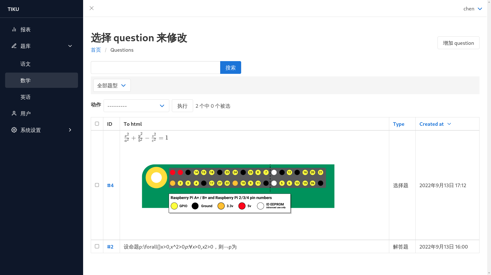

Django Juss Admin
=================

`v1 <https://github.com/ChanMo/django-juss/>`__

使用\ `Bulma.css <https://bulma.io/documentation/>`__\ 重写Admin模板

   Login Page

   ChangeList Page

Quick Start
-----------

Install
~~~~~~~

.. code:: bash

   pip install django-juss2

Update Settings.py
~~~~~~~~~~~~~~~~~~

.. code:: python

   INSTALLED_APPS = [
       'juss',
       'bulma',
       ...
   ]
   ...
   FORM_RENDERER = 'django.forms.renderers.TemplatesSetting'  

Create Basic Menus
~~~~~~~~~~~~~~~~~~

.. code:: bash

   python manage.py create_menus

Todo
----

-  [x] Menu In Model
-  [ ] Update Filter
-  [ ] default useful dashboard
-  [ ] dark mode
